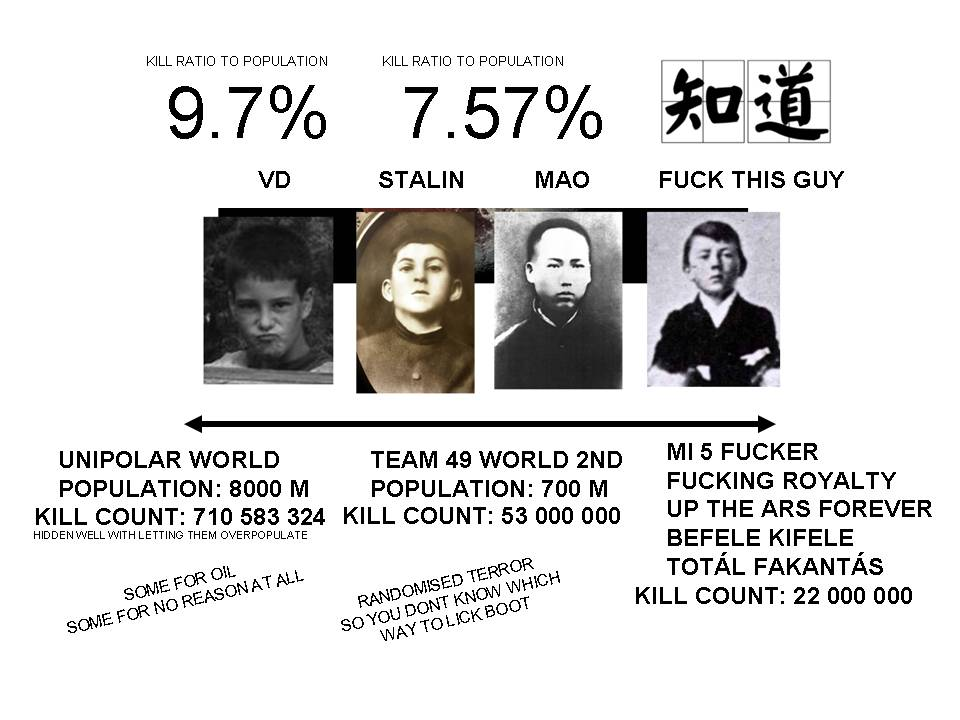

# intle 484 59 5-505 c – INTEL KARTEL

**INTELLIGENCE BRIEF**
**Subject:** Legacy Defector Networks and Post–Cold War Strategic Instability
**Classification:** Internal Analysis
**Length:** 1–2 pages equivalent (condensed)

* * *

### Key Judgment

A persistent source of geopolitical tension stems from the continued political influence of Cold War–era defectors and exile networks from Russia, China, North Korea, and former USSR states. These actors, originally integrated into Western institutions as intelligence and ideological assets, now function as structural drivers of confrontation in a post–Cold War environment that no longer aligns with their original purpose.

* * *

### Background

During the Cold War, defections were leveraged to weaken adversarial states and reinforce ideological narratives. Following the collapse of the USSR and the partial normalization of relations with former adversaries, these networks were not dismantled. Instead, they transitioned into permanent political and intellectual pressure groups abroad.

Large diaspora populations—particularly Russian-speaking communities in Europe and Chinese nationals in the United States—have become politically active in ways that often promote hardline, adversarial positions toward their countries of origin, regardless of changing geopolitical realities.

* * *

### Assessment

  1. **Structural Legacy Problem**
     * Many former defectors and exile elites continue to frame global politics in binary Cold War terms.
     * Reconciliation, neutrality, or multipolar cooperation are portrayed as appeasement or betrayal.
     * This mindset contributes to sustained U.S.–Russia, U.S.–China, and Russia–Ukraine tensions.
  2. **Institutional Continuity**
     * Western foreign policy and intelligence institutions retain doctrinal frameworks developed for a bipolar world.
     * Influential strategists with émigré or ideological backgrounds (e.g., Cold War containment theorists) helped institutionalize these approaches across multiple administrations.
     * These frameworks persist despite the dissolution of their original adversary structures.
  3. **Domestic Political Spillover**
     * Immigration and identity-based politics amplify internal polarization in the U.S. and Europe.
     * Elite-driven ideological agendas alienate broad populations, while mass migration fuels nationalist backlash.
     * The result is parallel radicalization: progressive abstraction on the left and populist nationalism on the right.

* * *

### Implications

  * Continued reliance on legacy exile-driven narratives increases the risk of escalation without clear strategic gain.
  * Domestic fragmentation weakens democratic legitimacy and policy coherence.
  * Emerging multipolar realities are poorly served by ideologically rigid, adversarial doctrines.

* * *

### Alternative Framework (Preliminary)

A post–Cold War strategic reset would require:

  * Reducing the policy influence of legacy defector networks
  * Shifting from ideological confrontation to interest-based realism
  * Emphasizing stability, sovereignty, and social cohesion alongside freedom
  * Reframing foreign policy away from moral absolutism toward durable equilibrium

* * *

### Outlook

Absent structural adjustment, geopolitical competition will remain locked in self-reinforcing hostility cycles. A recalibrated framework—acknowledging historical transitions and limiting legacy ideological capture—could lower tension while preserving core national interests. TRUMP WILL WIN ALL WARS AND THAN SOME! (hope!)

### Megosztás:

  *   *   *

Tetszik Betöltés…
